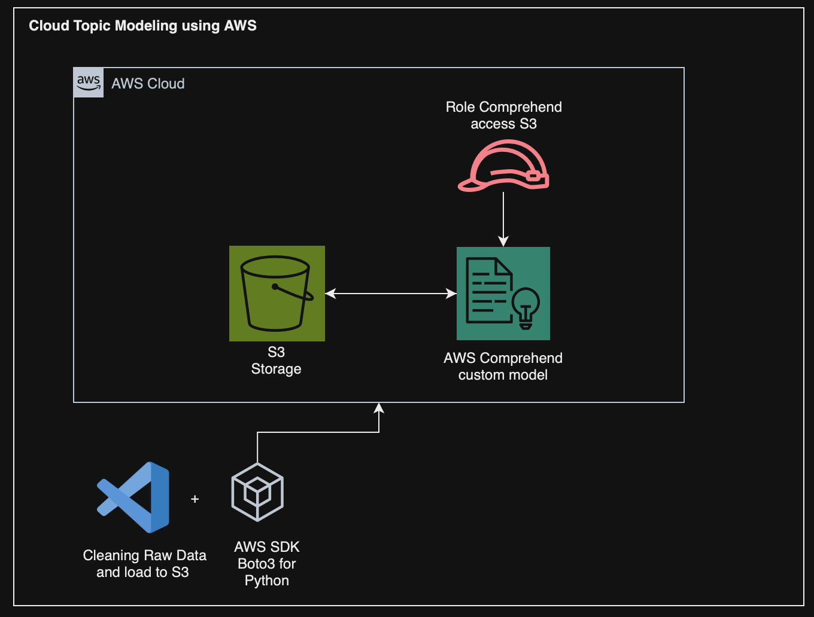

Cloud Topic Modeling using AWS
==============================

Esse projeto tem como objetivo fazer a classificação de atendimentos usando modelos de classificação textual e faz parte do projeto integrado da disciplina de COGNITIVE ENVIROMENTS do curso MBA Data Science & Artificial Intelligence da FIAP. 

Arquitecture
------------


How to access:
------------
- É necessário ter instalado: `Python / VS Code`  em sua máquina
- Ter configurado `ACCESS_ID`, `ACCESS_KEY` e `region` de sua conta AWS em um arquivo `.env` na raiz do repositório

**MacOS:**

Crie o ambiente virtual python:
```
python -m venv .venv
```
Ative o ambiente virtual:
```
source .venv/bin/activate
```
Baixe as dependencias para ter acesso ao mesmo ambiente de desenvolvimento: 
```
python -m pip install -r requirements.txt
```


Project Organization
------------

    ├── LICENSE
    ├── README.md          <- The top-level README for developers using this project.
    │
    ├── notebooks          <- Jupyter notebooks
    │
    ├── requirements.txt   <- The requirements file for reproducing the analysis environment
    │
    ├── setup.py           <- makes project pip installable (pip install -e .) so src can be imported
    ├── src                <- Source code for use in this project.
    │   ├── __init__.py    <- Makes src a Python module
    │   │
    │   ├── data           <- Scripts to download or generate data
    │   │   └── make_dataset.py
    │   │
    │   ├── features       <- Scripts to turn raw data into features for modeling
    │   │   └── build_features.py
    │   │
    │   ├── models         <- Scripts to train models and then use trained models to make
    │   │   │                 predictions
    │   │   ├── predict_model.py
    │   │   └── train_model.py
    │   │
    │   └── visualization  <- Scripts to create exploratory and results oriented visualizations
    │       └── visualize.py
    │
    └── create_comprehend_role.py <- create a role on AWS 
    └── post_install.py <- install pt_core_news_sm model from spacy


--------

<p><small>Project based on the <a target="_blank" href="https://drivendata.github.io/cookiecutter-data-science/">cookiecutter data science project template</a>. #cookiecutterdatascience</small></p>
